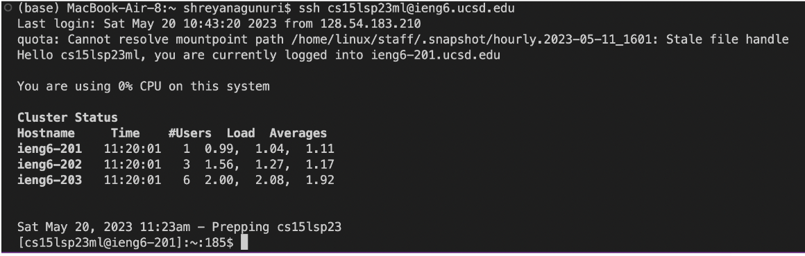
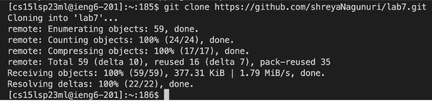
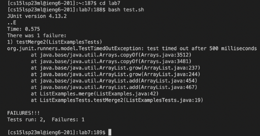
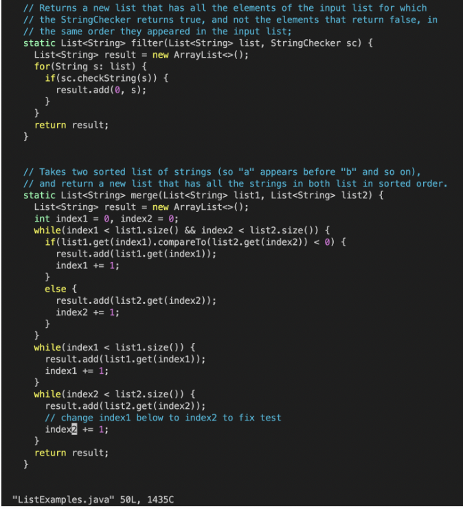
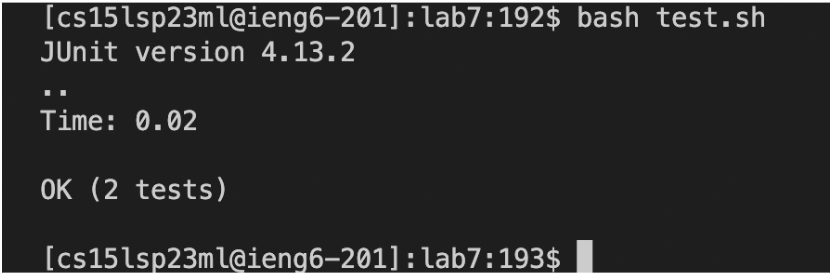
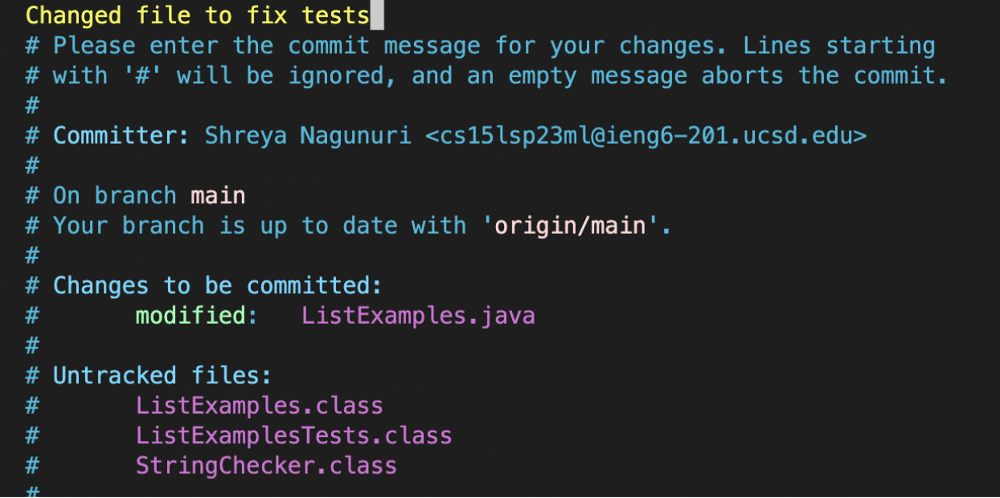
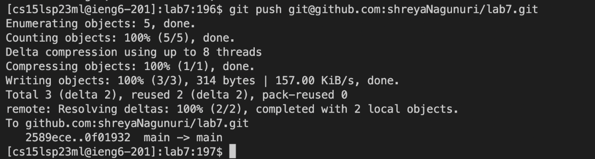

# Lab Report 4
For this lab report I had to recreate some tasks and log the keys that I used to produce those results. The steps I had to reproduce are as listed below:
1. Setup Delete any existing forks of the repository you have on your account
2. Setup Fork the repository
3. The real deal Start the timer!
4. Log into ieng6
5. Clone your fork of the repository from your Github account
6. Run the tests, demonstrating that they fail
7. Edit the code file to fix the failing test
8. Run the tests, demonstrating that they now succeed
9. Commit and push the resulting change to your Github account (you can pick any commit message!)

Steps 1-3) For these steps, I didn't have to log anything since these were all basic set up for the following tasks. 

Step 4) Log into ieng6
The keys that I pressed to get to this step are ssh `<space>` cs15lsp23ml@ieng6.ucsd.edu `<enter>`
The command ssh allows me to gain access into the remote desktop and the log string of text is my username. 
Note that I didn’t need to use my password to log in because I have configured the desktop to not need it when logging in. 

Step 5)Clone your fork of the repository from your Github account
To accomplish this task I typed:
git `<space>` clone `<space>` `<command v>` `<enter>`
Since I was trying to access information on github, I used the command git to use the following command clone. Clone allows me to access the files on the repository. I typed `<command v>`
in order to paste the link to the github repository: https://github.com/shreyaNagunuri/lab7.git

Step 6) Run the tests, demonstrating that they fail
To run the tests, I used the following commands:
cd `<space>` la `<tab>` `<enter>` bash `<space>` test.sh `<enter>`
Firstly, I had to do use cd to go into ~/lab7 directory since all of the necessary files are in that folder. I also used `<tab>` to autocomplete lab7. Next, I used bash test.sh to run the tests because in that bash script are two command
for compiles and running the tests. Using this bash script instead of the typing the necessary commands, saved me lots of time! The tests ended up failing since the java file had the wrong code. 

Step 7) Edit the code file to fix the failing test
To fix the code this is what I ran:
vim `<space>` L `<tab>`.`<tab>` `<enter>` x `<esc>`i 2 `<esc>`:wq `<enter>`
These keystrokes may seem a little confusing but it is pretty simple. I first typed vim because I needed to use the text editor to change the necessary file. I next typed "L" and tab to autocomplete
to ListExamples, then I typed "." and `<tab>` to autocomplete to ListExamples.java. After clicking enter, I immediately clicked x since I was in the correct position to delete the character "1".
I next typed `<esc>` i to go into insert mode. I inserted "2", pressed `<esc>`, and type :wq to save and quit vim. 

Step 8) Run the tests, demonstrating that they now succeed
I ran the tests similarly to before by typing bash `<space>` test.sh `<enter>`
I used bash test.sh to run the tests because in that bash script are two commands for compiles and running the tests. The tests ended up passing because of my changed.

Step 9) Commit and push the resulting change to your Github account (you can pick any commit message!)
To accomplish this step, I typed: 

git `<space>` add `<space>` ListExamples.java `<enter>` git `<space>` commit `<enter>` “Changed file to fix tests” `<esc>` :wq `<enter>` git `<space>`push `<crl v>`

I first used git add in order to tell git that I was going to commit and make changes in the file. I next ran git commit to add a message on what type of change I had made to the file. 
I used :wq to save and quit. After this, I needed to push my changes to github so I used git push and in my paste I had git@github.com:shreyaNagunuri/lab7.git . I didn't need to put in my username or
password because I had confired it to save me a safe user. 

